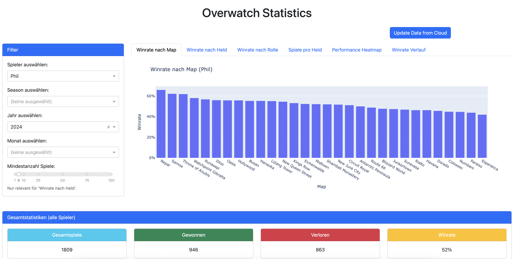

# Overwatch Stats (Private)

Private Overwatch dashboard for our friend group. Built with Dash/Plotly, hosted on Render.com.

**Live:** https://ow-stats-private.onrender.com/

---

## What it does

Interactive stats dashboard based on our stored match data. Matches are entered via a small web form, saved to a JSONL file, and synced with Firebase Firestore.

---

## Features

**Tabs / Views**
- **Daily Report** – Daily overview: map banner, spotlight cards (most-played hero, biggest flex, one trick pony, hero carry), full lineup, visual match timeline
- **Map & Mode Stats** – Winrate/count by map, gamemode distribution, attack/defense breakdown
- **Role Assignment** – Free role assignment (Tank ×1, Damage ×2, Support ×2) with bench, optional map filter, and hero detail mode; shows matching match history
- **Hero Stats** – Winrate/count per hero, filtered by player/season
- **Role Stats** – Winrate/count per role
- **Performance Heatmap** – Role × Map winrate matrix with tooltip (games/wins/losses)
- **Winrate Trend** – Cumulative winrate over games, optionally filtered by hero
- **Match History** – Full match history with map and hero images; filterable by player and hero; pagination

**General**
- Language: EN / DE, persisted in browser localStorage
- Theme: Light / Dark mode, also persistent
- Live viewer counter (shows active browser tabs)
- Sidebar filters: player, season (takes priority), year, month, minimum games
- Comparison mode: up to 3 players simultaneously in graphs

**Patchnotes**
- Separate page at `/patchnotes` (language via `?lang=de`)
- Generated from `PATCHNOTES.md` (see below)

---

## Architecture

```
app.py                  <- Dash app, layout, shared callbacks
config.py               <- PLAYERS, env vars, defaults
mappings.py             <- Hero->Role, Map->Gamemode, all known maps/heroes
firebase_service.py     <- Firebase Firestore connection

data/
  loader.py             <- JSONL read/write, build DataFrame, reload()
  state.py              <- SQLite for online counter + update token (cross-worker)

utils/
  i18n.py               <- tr("key", "en") -> translated string (~95 keys)
  assets.py             <- URLs for map/hero images and branding logos
  formatting.py         <- Time and duration parsing (HH:MM, m:ss)
  filters.py            <- filter_data(), calculate_winrate(), is_valid_hero()

pages/
  daily.py              <- Daily Report callback
  history.py            <- Match History callbacks
  roles.py              <- Role Assignment callbacks
  stats.py              <- Stats graph callbacks
  patchnotes.py         <- Flask route /patchnotes (not Dash)

api/
  routes.py             <- Flask routes: /api/matches, /input, /health, /bye, SSE

assets/
  input.html            <- Match entry form (plain HTML/JS, not Dash)
  heroes/               <- Hero portraits (.png)
  maps/                 <- Map background images (.jpg/.png)
  branding/             <- Custom logos (optional, see below)
  theme.css             <- Dark mode, branding, layout classes
```

**Data flow:**
`local_data.jsonl` -> `loader.reload()` -> `loader.get_df()` (pandas DataFrame) -> callbacks -> Plotly graphs / Dash HTML -> browser

**Update mechanism:**
New match saved via `/input` -> `loader.patch_with_match()` sets a new `data_token` in SQLite -> all open tabs detect the change every 5 seconds and reload data.

---

## Local Setup

**Requirement:** Python 3.11+

```bash
# 1. Install dependencies
pip install -r requirements.txt

# 2. Start the app
python app.py
```

Open http://127.0.0.1:8050

---

## Configuration

### `config.py`

| Variable | Description |
|---|---|
| `PLAYERS` | List of all players (order = dropdown order) |
| `LOCAL_DATA_FILE` | Path to the JSONL data file (default: `local_data.jsonl`) |
| `DEFAULT_SEASON` | Fallback season for Firebase queries |
| `POLL_UPDATE_SECONDS` | How often tabs check for updates (default: 5s) |
| `ONLINE_ACTIVE_WINDOW` | Seconds until a tab is considered inactive (default: 20s) |

### Environment variables

| Variable | Description |
|---|---|
| `INPUT_PIN` | PIN for the match entry form |
| `FIREBASE_CREDENTIALS_JSON` | Full JSON content of the Firebase service account key |
| `POLL_UPDATE_SECONDS` | Override the update poll interval |
| `ONLINE_ACTIVE_WINDOW_SECONDS` | Override the online counter window |

---

## Deployment (Render.com)

Configuration lives in `render.yaml`. The start command is:

```
gunicorn app:server --bind 0.0.0.0:$PORT --workers 1 --threads 4 --timeout 120
```

> **Important:** Only 1 worker, because the in-memory DataFrame and SQLite state are not synchronized across processes. Multiple threads are fine.

The following environment variables must be set manually in the Render dashboard:
- `INPUT_PIN`
- `FIREBASE_CREDENTIALS_JSON`

---

## Match Data Format

Data lives in `local_data.jsonl` (one JSON line per match, gitignored). Firebase Firestore serves as a backup and bootstrap source when the local file is missing.

Each line has the following structure:

```json
{
  "match_id": 42,
  "result": "Win",
  "map": "King's Row",
  "gamemode": "Hybrid",
  "attack_defense": "Attack",
  "date": "2026-03-07T20:30:00",
  "season": "Season 14",
  "players": {
    "Bobo":   { "hero": "D.Va",    "role": "Tank"    },
    "Phil":   { "hero": "Tracer",  "role": "Damage"  },
    "Steven": { "hero": "Ana",     "role": "Support" },
    "Jaina":  { "hero": "Mercy",   "role": "Support" }
  }
}
```

Hero names are automatically normalized on load (e.g. `"dva"` -> `"D.Va"`, `"Soldier"` -> `"Soldier 76"`).

---

## Managing Patchnotes

The `/patchnotes` page is generated directly from `PATCHNOTES.md`. To add an entry, prepend it to the file:

```markdown
### 2026-03-07 --- abc1def --- Short update title

- Notes: Description shown on the patchnotes page.
```

- Date must be in `YYYY-MM-DD` format
- `- Notes: ...` is the displayed text (free-form)
- Entries without `- Notes:` are only shown if the short title is registered in the translation table in `pages/patchnotes.py`

---

## Branding (Custom Logos)

Place logos in `assets/branding/`:

| File | Used when |
|---|---|
| `logo_dark.*` | In **Light Mode** (dark logo on white background) |
| `logo_light.*` | In **Dark Mode** (light logo on dark background) |

Supported formats: `png`, `jpg`, `jpeg`, `webp`, `svg`. If one file is missing, the other is used as a fallback (potentially with a CSS `invert()` filter).

---

## Hero and Map Images

- **Heroes:** `assets/heroes/<name>.png` – name must match the normalized hero name (lowercase, special characters removed, e.g. `dva.png`, `soldier76.png`, `wreckingball.png`)
- **Maps:** `assets/maps/<name>.jpg` – normalized the same way, e.g. `kingsrow.jpg`
- If an image is missing, `default_hero.png` or `default.png` is shown as a fallback
