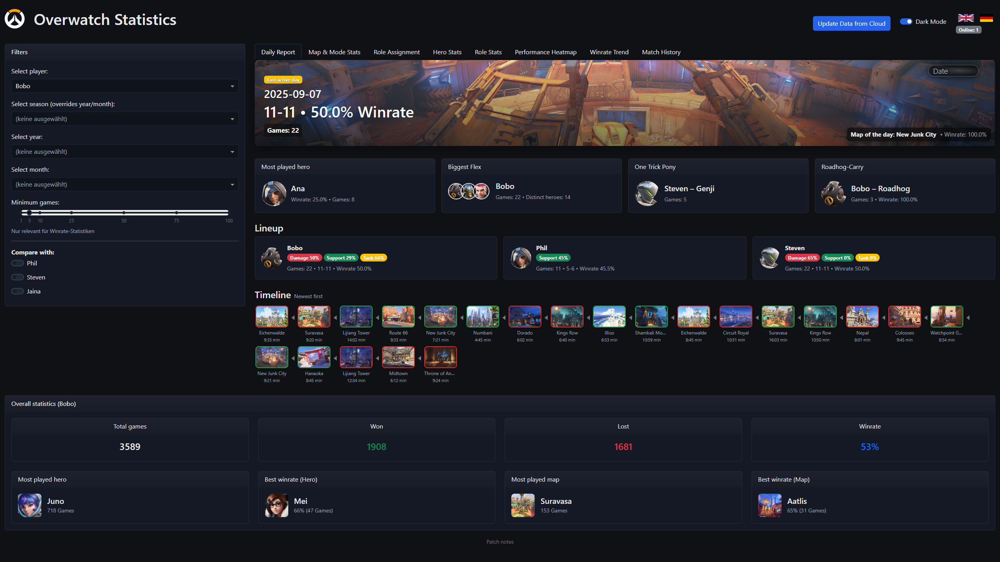

## Overwatch Stats (Private)

This is a private Overwatch stats dashboard for me and my friends. It’s tailored to our sheet format and hosting setup and is not meant as a reusable framework. The public, general-purpose version lives in a different repository.

Key points:
- Private codebase, opinionated to our data and workflow.
- No intention to publish as a template. For a generic/open version, use the separate public repo.



## What it does
An interactive dashboard (Dash/Plotly) to explore our group’s Overwatch match data from an Excel/Google Sheet. It supports filtering by player/season/time, comparisons, and multiple visualizations.

## Features
- Data updates (minimal UI):
   - Manual “Update from Cloud” button.
   - Hidden background auto-check using ETag/Last-Modified + SHA-256; interval configurable via env `AUTO_UPDATE_MINUTES` (default from `constants.py`).
   - One-time lazy fetch on startup.
   - Secure webhook `/refresh-data` for external schedulers (requires `REFRESH_TOKEN`).

- Filters & i18n:
   - Filter by player, season (overrides year/month), year, month.
   - Language toggle (🇬🇧/🇩🇪), persisted in local storage; English default.

- Theme:
   - Light/Dark mode toggle, persisted in local storage.
   - Plotly dark template and adjusted UI styles for readability.

- Visualizations:
   - Map & Mode stats: winrate/plays, gamemode distribution, Attack/Defense breakdown; detailed stacked/grouped views.
   - Hero stats: winrate/plays with min-games filter.
   - Role stats: winrate/plays by role.
   - Performance heatmap (Role x Map winrates) with rich tooltips.
   - Winrate trend over time (optional hero filter).

- Role assignment enhancements:
   - Enforce role maxima (Tank=1, Damage=2, Support=2) and uniqueness across roles.
   - Bench (“Nicht dabei”) multi-select to exclude players.
   - Optional map filter for role stats/history.
   - Detailed mode to filter specific heroes by player.
   - Matching matches list with thumbnails, result badges, and inclusion of unassigned-but-active players.
   - Pagination with “Load more” and adjustable step.

- Match history:
   - Player and hero filters; includes unassigned-but-active players.
   - “Load more” pagination.

- Branding:
   - Optional custom logos in `assets/branding/` (`logo_light.*`, `logo_dark.*`) with graceful fallback; currently a specific dark logo URL is used.

- Polish:
   - Enlarged map thumbnails (no increase in row height).
   - Subdued disabled slider style in dark mode.
   - Theme and language persistence fixed for PythonAnywhere load behavior.

## Setup
1) Data source
- Local: put your stats in `local.xlsx` (same columns as our sheet), or
- Cloud: set `url` in `constants.py` to a direct CSV export link (e.g., Google Sheets `uc?export=download` URL).

2) Install dependencies
Use your Python 3.11+ environment and install:
```
pip install -r requirements.txt
```

3) Run locally
```
python app.py
```
Open http://127.0.0.1:8050

## Configuration
- `constants.py`
   - `url`: CSV download URL for cloud updates.
   - `players`: list of players (used for filters, comparisons, and history rendering).
   - `AUTO_UPDATE_MINUTES`: default background check interval (minutes).
- Environment variables
   - `AUTO_UPDATE_MINUTES`: override interval for auto updates.
   - `DISABLE_STARTUP_CLOUD_CHECK=1`: skip the initial lazy fetch.
   - `REFRESH_TOKEN`: required to call POST `/refresh-data` for forced refreshes.

## Data format (expected columns)
Minimum columns in the sheet/Excel:
- `Match ID` (numeric, used for sorting newest-first)
- `Win Lose` (Win/Lose)
- `Map`
- `Season`, `Jahr` (Year), `Monat` (Month)
- Per player: `{Name} Rolle` and `{Name} Hero`

The app normalizes role labels (DPS → Damage, etc.). Date column `Datum` is parsed if present.

## Notes
- This repository is private and tailored to our data and usage. For a public, reusable solution, see the separate open-source repo.
- The live demo mentioned in older docs is not part of this private version.
